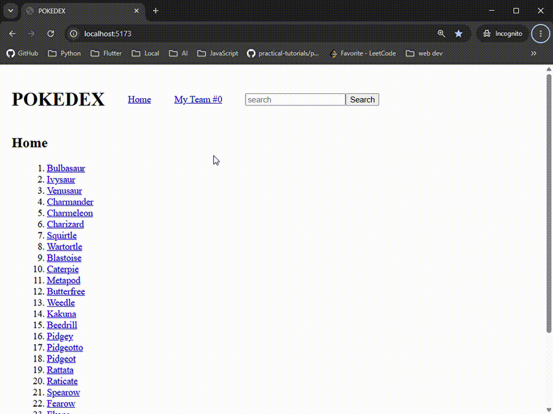

# Pokémon Informant

**[Live Demo](https://gadm12.github.io/pokemon-informant/)**

A React-based Pokédex application that allows users to browse Pokémon, view detailed information, search by name or ID, and build a team of up to six Pokémon.

This project was originally developed as a React assessment and demonstrates my ability to work with React components, client-side routing, external APIs, application state, conditional rendering, and end-to-end testing.

## Features

- Browse a list of Pokémon retrieved from the PokeAPI
- View individual Pokémon information
- Search for Pokémon by name or ID
- View Pokémon images, types, and moves
- Add Pokémon to a personal team
- Remove Pokémon from the team
- Prevent duplicate Pokémon from being added
- Limit teams to a maximum of six Pokémon
- Dynamically style Pokémon cards based on type
- Handle invalid Pokémon searches
- Handle invalid application routes with a custom 404 page
- Navigate between pages using React Router

## Preview



## Tech Stack

- **React**
- **JavaScript**
- **Vite**
- **React Router**
- **PokeAPI**
- **Cypress**
- **HTML**
- **CSS**

## What I Built

I implemented the application's React functionality using the provided project scaffolding.

My work included:

- Building reusable React components for displaying Pokémon
- Fetching and processing Pokémon data from the PokeAPI
- Creating dynamic routes for individual Pokémon
- Managing the user's Pokémon team with React state
- Implementing Catch and Release functionality
- Enforcing the six-Pokémon team limit
- Preventing duplicate team entries
- Building Pokémon search by name and ID
- Creating dedicated pages for invalid searches and unknown routes
- Applying Pokémon type-based styling dynamically
- Integrating the application with the provided Cypress end-to-end test suite

## Application Routes

| Route                   | Description                                    |
| ----------------------- | ---------------------------------------------- |
| `/`                     | Displays the Pokédex home page                 |
| `/pokemon/:pokemonName` | Displays information for an individual Pokémon |
| `/team`                 | Displays the user's current Pokémon team       |
| Invalid Pokémon search  | Displays the missing Pokémon page              |
| Unknown route           | Displays the custom 404 page                   |

## Getting Started

### 1. Clone the repository

```bash
git clone <your-repository-url>
cd pokemon-informant
```

### 2. Install dependencies

```bash
npm install
```

### 3. Start the development server

```bash
npm run dev
```

The application will run through the Vite development server.

## Testing

The project uses Cypress for end-to-end testing.

Start the application:

```bash
npm run dev
```

Then, in another terminal, open Cypress:

```bash
npm run cy:open
```

The test suite verifies application behavior including navigation, API-driven Pokémon pages, team management, searching, dynamic card styling, and error handling.

## What I Learned

This project strengthened my understanding of building React applications around external API data. It gave me hands-on experience with component composition, state management, React Router, asynchronous API requests, conditional rendering, and testing user workflows with Cypress.

It also reinforced the importance of designing components that can be reused across different parts of an application, such as using the same Pokémon card functionality for individual Pokémon pages and the user's team.

## API

Pokémon data is provided by the **PokeAPI**.

## Project Background

This application was originally completed as part of a React assessment. The initial Vite project structure, styling resources, and Cypress test suite were provided as scaffolding. I implemented the application functionality required to turn that scaffolding into the working Pokédex described above.
